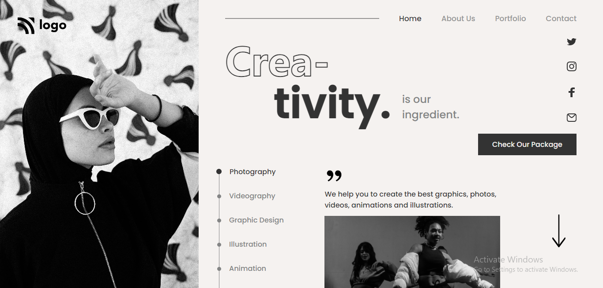

# Portfolio Project 14

## Description

This project is a home page for a graphic design company. It is created using HTML and CSS and is responsive for screens of various sizes.

### Learnings from this project :-

- How to position elements using CSS `Flexbox` and `position` property
- How to use CSS psuedo-selectors like `::before` and `::after`
- How to use `media-queries` to make webpage responsive

### Preview of the project :-

### [Live link](https://portfolio-project-14-three.vercel.app/) of the project.
